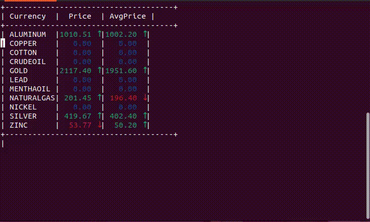

# Producer-Consumer-Implementation
An implementation of the [producer-consumer problem](https://afteracademy.com/blog/the-producer-consumer-problem-in-operating-system/) which is visually aided with [dashboard](#sample-output) to view the current commodities being produces and consumed, the program is implemented using shared memory, semaphores and mutexes in C. The program creates a buffer of variable size, one process for consumer, infinite number of processes for producers. The producer process produces a random number indicating the price of a certain commoditity based on gaussian distribution and puts it in the buffer. The consumer program consumes what's in the buffer. The producer and consumer processes are synchronized using semaphores and mutexes.

## Table of Content
- [Producer-Consumer-Implementation](#producer-consumer-implementation)
  - [Table of Content](#table-of-content)
  - [Introduction](#introduction)
  - [Producer](#producer)
  - [Consumer](#consumer)
  - [Psuedo Code](#psuedo-code)
  - [Requirements](#requirements)
  - [Compilation](#compilation)
  - [Sample Input](#sample-input)
    - [Consumer Process](#consumer-process)
    - [Producer Process](#producer-process)
  - [Sample Output](#sample-output)
  - [Remarks](#remarks)
  - [Author](#author)

## Producer
- All producers are processes running the same codebase. Producers are to be run concurrently, either in
separate terminals, or in the background. While running a producer, you will specify the following
command line arguments:
    - Commodity name.
    - Commodity Price Mean(μ).
    - Commodity Price Standard Deviation(σ).
    - The interval between two consecutive items produced by this producer in milliseconds.
    - Bounded buffer size.
- For simplicity, the commodities are limited to GOLD, SILVER, CRUDEOIL, NATURALGAS, ALUMINIUM, COPPER, NICKEL, LEAD, ZINC, MENTHAOIL, and COTTON.

## Consumer
- The consumer prints the current price of each commodity, along the average of the current and past 4 readings. An Up/Down arrow to show whether the current Price (AvgPrice) got increased or decreased from the prior one.
- The consumer is to be run as a single process. While running the consumer, you will specify the following command line arguments:
    - Bounded buffer size.
## Psuedo Code
```c
void producer() {
    while(True) {
        produce()
        wait(E) // wait on empty semaphore
        wait(S) // wait on mutex semaphore
        append()
        signal(S) // signal mutex semaphore
        signal(F) // signal full semaphore
    }
}

void consumer() {
    while(True) {
        wait(F) // wait on full semaphore
        wait(S) // wait on mutex semaphore
        consume()
        signal(S) // signal mutex semaphore
        signal(E) // signal empty semaphore
    }
}
```
- You can find the detailed implementation for the producer and consumer processes in the following files:
    - [producer.cpp](https://github.com/yousefkotp/Producer-Consumer-Implementation/blob/main/producer.cpp)
    - [consumer.cpp](https://github.com/yousefkotp/Producer-Consumer-Implementation/blob/main/consumer.cpp)

## Requirements
- [GCC](https://gcc.gnu.org/)
- [GNU Make](https://www.gnu.org/software/make/)

- You can install the requirements using the following command:
```bash
sudo apt-get install build-essential
```

## Compilation
- You can compile the code using the following command:
```bash
make
```
## Sample Input

### Consumer Process
- Only one consumer process is allowed to run at a time.
- The consumer process takes the following arguments in the following order:
    - Bounded buffer size.
- The consumer process can be run using the following command:
```bash
./consumer 10
```

### Producer Process
- The producer process takes the following arguments in the following order:
    - Commodity name.
    - Commodity Price Mean(μ).
    - Commodity Price Standard Deviation(σ).
    - The interval between two consecutive items produced by this producer in milliseconds.
    - Bounded buffer size.

- The producer process can be run using the following command:
```bash
./producer GOLD 100 10 200 10
```

- Infinite number of producer processes can be created.
- Commodity name is case sensitive.
- **Note:** You can make the producer process runs in the background by adding `&` at the end of the command.

## Sample Output

## Remarks

- Consumer process should be run first before starting any producer process.
- The program can be run on any Linux distribution.
- The program is tested on [Ubuntu 22.04.1 LTS](https://releases.ubuntu.com/22.04/).


## Author
- [Yousef Kotp](https://github.com/yousefkotp)

